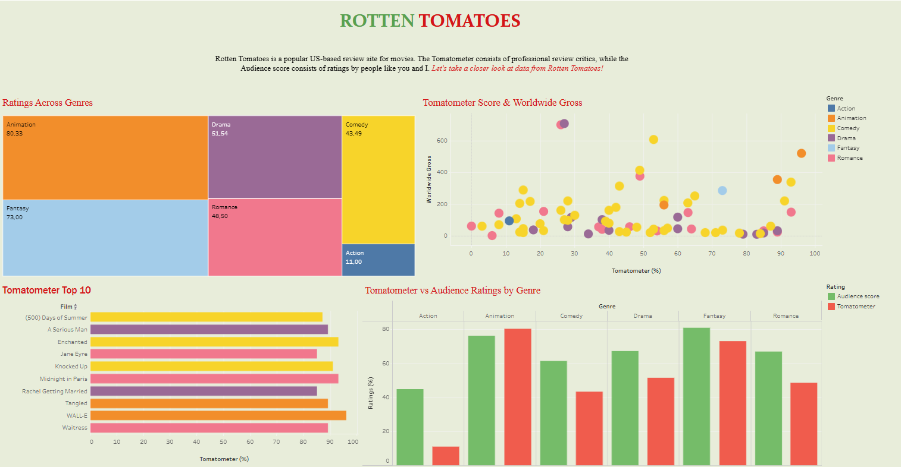

# Rotten Tomatoes Interactive Dashboard

Un'analisi visiva dei dati di Rotten Tomatoes, realizzata con Tableau per confrontare i voti della critica (Tomatometer) con quelli del pubblico attraverso diversi generi cinematografici.

## Link al Progetto
https://public.tableau.com/app/profile/e.z2465/viz/Cartella2_17795491767280/Dashboard1

## Anteprima della Dashboard

## Funzionalità Principali
- **Ratings Across Genres:** Analisi dell'impatto dei generi in base ai punteggi dei critici.
- **Tomatometer vs Audience:** Un confronto diretto tramite grafici a barre per vedere dove pubblico e critica non vanno d'accordo.
- **Top 10 Film:** La classifica dei 10 film con il punteggio Tomatometer più alto.
- **Worldwide Gross vs Score:** Grafico a dispersione per capire se un voto alto corrisponde a maggiori incassi globali.

## Strumenti Utilizzati
- **Tableau Public** (Desktop / Web Authoring)
- **PostgreSQL** per realizzare i dataset
- Formattazione avanzata dei layout e delle legende fluttuanti.
